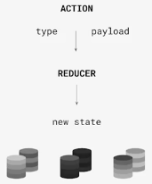

# MANEJO PROFESIONAL DEL ESTADO

## Estado y ciclo de vida con Hooks y Clases

## Estados independientes y compuestos

### Estados independientes

```js
const [error, setError] = useState(false);
const [loading, setLoading] = useState(false);
const [value, setValue] = useState("");
```

### Estados compuestos con useState

```js
const [state, setState] = useState({
  value: "",
  error: false,
  loading: false,
});
```

## Código imperativo y declarativo en React

**Paradigma**
Paradigma de programación son la forma que traducimos lo que pensamos al código que vamos a escribir.
.
**Paradigma imperativo:**
Describir el paso a paso de lo que vamos a hacer en el código.
.
**Paradigma declarativo**
Cuanto mas declarativo, menos se concentra en el paso a paso. Eso se vera en otra función.

### Estados imperativos con useState

### Estados semideclarativos con useState

En vez de cambiar el estado en el mismo jsx creamos funciones y lo invocamos

### Reducer

**¿Qué es un reducer?**

- Son una herramienta que nos permite declarar todos los posibles estados de nuestra App para llamarlos de forma declarativa.
- Necesitan 2 objetos esenciales: los estados compuestos y las acciones.

**Los estados compuestos:** Son un objeto donde van a vivir como propiedades todos nuestros estados

**Acciones**

- Responsables, al ser disparados, de pasar de un estado a otro.
- Este objeto tiene 2 propiedades: action type y action payload.

**Action type:** Define el nombre clave para encontrar el nuevo estado.

**Action payload:** Es opcional e importante con estados dinámicos. Un estado es dinamico cuando depende del llamado de un API, de lo escrito por el usuario en un input, etc. Estos son estados dinámicos y los recibimos con un payload.

**Flujo de trabajo:**

- Definimos distintos tipos de acciones con type y payload.
- Enviamos estas acciones a nuestro reducer.
- El reducer define los posibles estados por donde pasara nuestra App.
- Con action type elegimos cual de esos estados queremos disponer con el cambio o evento del usuario.
- Con action payload damos dinamismo a dicho estado. Será el mismo estado pero le daremos características especiales



#### 3 formas de crear un reducer

[Ejemplos](./src/UseReducer.jsx)

#### Action creators y actionTypes

### ¿Qué son los estados derivados?

Los estados deribados se crean a partir de los estados principales, ej: calculos matematicos, busquedas de items

- Variables que no se crean su propio estado pero dependen de un estado anterior
- No llaman a React.useState para definir su información
- Utilizan la información que ya habíamos guardado antes en otro estado y a partir de ahí algún calculo, cuenta, registro, etc.
- Pueden tener la misma convencion de nombres que los estados “normales”
- Se actualizan automáticamente con los cambios a los estados “normales”.
- Se crean a partir de estados normales.

_NO SE CREAN USANDO:_ React.useState
